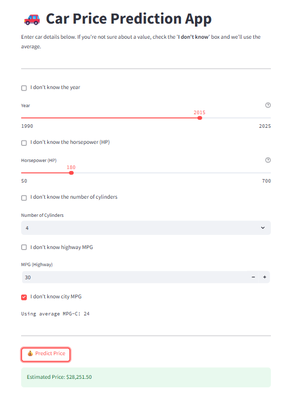

#  Car Price Prediction with EDA and Machine Learning

This project performs EDA and builds a regression model to predict car prices based on technical specs such as horsepower, cylinders, fuel economy, and year.



## Features
- Data cleaning and outlier removal
- Exploratory Data Analysis (EDA)
- Linear regression model
- Performance evaluation (MAE, RMSE)
- Interactive Streamlit app for prediction

## Structure
- `notebook/`: EDA and modeling
- `app/`: Streamlit app
- `model/`: Saved ML model
- `data/`: Input dataset

## How to Run

```bash
pip install -r requirements.txt
streamlit run app/app.py
