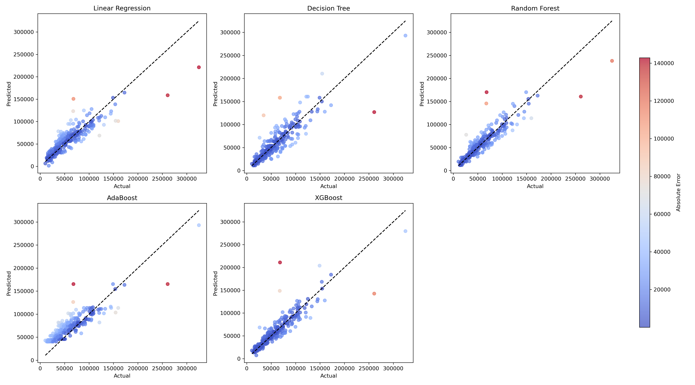
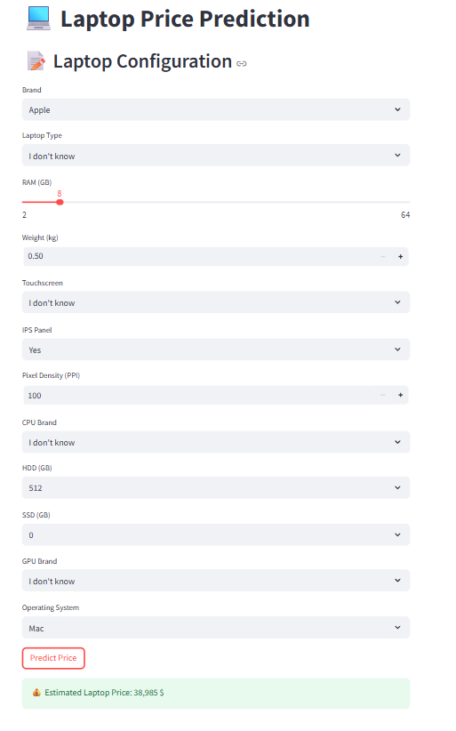

# 💻 Laptop Price Prediction App

A complete machine learning project to predict laptop prices based on technical specifications using regression models. It includes data preprocessing, model training, evaluation, and a user-friendly **Streamlit interface** for real-time prediction.

---
  
  

##  Overview

This project performs:

-  **Data Preprocessing** and cleaning in Jupyter Notebook
-  **Model Training** with 5 regression algorithms:
  - Linear Regression
  - Decision Tree Regressor
  - Random Forest Regressor
  - AdaBoost Regressor
  - XGBoost Regressor
-  **Visualization** of model performance (Actual vs Predicted)
-  **Interactive Streamlit App** for live price prediction

---

## Run model training script
python train_models.py

This will:
Train all models
Save them in model/
Generate performance plot

## Launch the Streamlit app
streamlit run app.py

